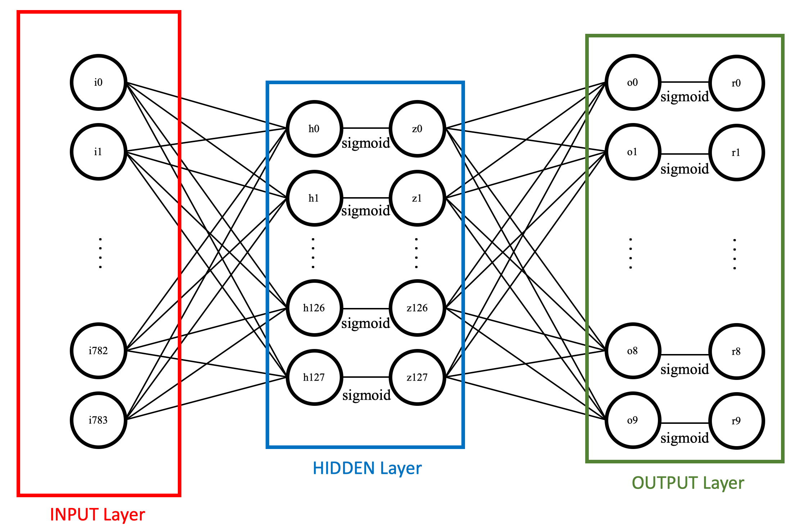
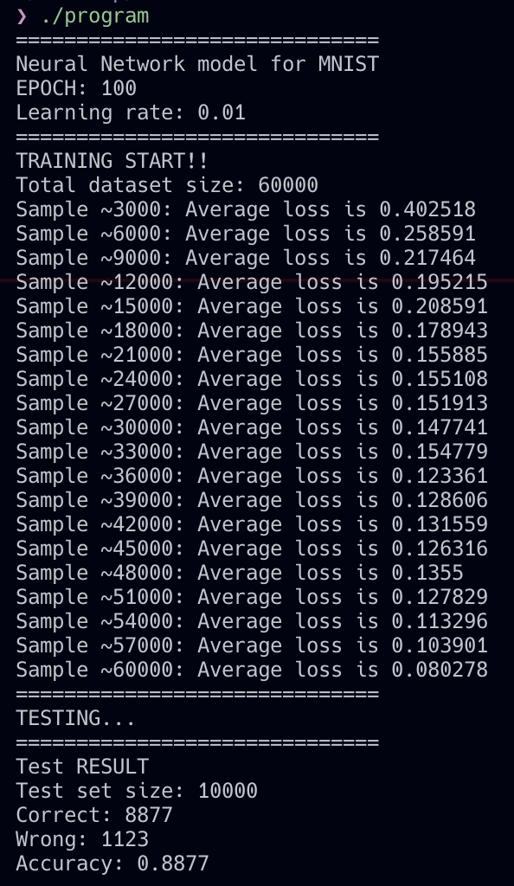

## C++ Neural Net Classifier for MNIST 

This repository contains a neural net classifier for MNIST implemented with C++. The code was implemented for educational purposes, and also contains document and template, which helps you implement your classifier.

### Description

The neural net classifier consists of three layers: INPUT, HIDDEN, and OUTPUT. Successive layers are *fully-connected* to each other and use *sigmoid* as an activation function. 

For a detailed explanation, check the [documentation](docs/documentation.pdf).

### Repo Components

#### `src/`

This directory contains the source code of the classifier. You can simply compile it by executing `make run`. 

*I didn't provide cmake...helpful to be contributed...*

#### `docs/`

##### Document

I provided the [documentation](docs/documentation.pdf) that contains a detailed description. The document contains **background knowledge**, **structure**, **detailed implementation** about the classifier. I recommend reading it to fully understand the code. 

The document also offers you the **Exercise**, or assignment. You can easily design & implement you own classifier by simply following the instruction. The exercise consist of two sections:
- Written assignment
- Implementation

You final executable should generate such output:

Good Luck!!

##### Answer

As I mentioned above, the exercise contains a written assignment, and I also uploaded the answer for the section.

#### `template/`
This directory contains a template code of the classifier. If you want to implement MNIST NN classifier on your own, you can simply use the template in this directory. 
(You can also find the download link for .zip file in the [documentation](docs/documentation.pdf))

### Thanks to...

[HyTruongSon/Neural-Network-MNIST-CPP](https://github.com/HyTruongSon/Neural-Network-MNIST-CPP), which inspired my work

